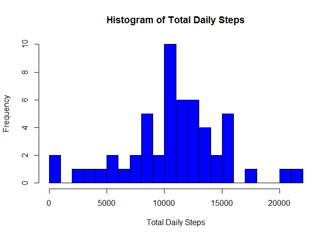
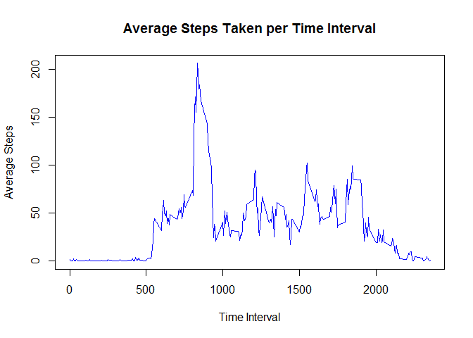

# Reproducible Research: Peer Assessment 1

## Loading and preprocessing the data

```r
library("tools")

# file informationn
filelink <- "https://d396qusza40orc.cloudfront.net/repdata%2Fdata%2Factivity.zip"
filename <- "activity.zip"
filechecksum <- "61e0c1f8c4a736ff1ab0f8863344b301"

# check to see if file is missing or checksum has changed 
if (!file.exists(filename)|md5sum(filename) != filechecksum) {
        # download the file.
        download.file(filelink, filename)
        }         

# unzip and read in CSV file and remove incomplete cases
unzip("activity.zip")
activity <- read.csv("activity.csv")
#activity <- activity[complete.cases(activity),]
```
The data set that was used for the analysis is the one that was included in the [RepData_PeerAssessment1 Git repository](https://github.com/rdpeng/RepData_PeerAssessment1) (commit 80edf39c3bb508fee88e3394542f967dd3fd3270).  It can also be downloaded from [https://d396qusza40orc.cloudfront.net/repdata%2Fdata%2Factivity.zip](https://d396qusza40orc.cloudfront.net/repdata%2Fdata%2Factivity.zip).

## What is mean total number of steps taken per day?
The following histogram shows the distribution of frequencies of the number of steps taken each day:

```r
library(plyr)
# summarize the data by date
daily_steps <- ddply(activity, c("date"), summarise, total_steps = sum(steps, na.rm = TRUE))

# create histogram
hist(daily_steps$total_steps,  breaks = 20 ,col="blue", xlab = "Total Daily Steps", main = "Histogram of Total Daily Steps")
```

 


The average number of steps taken was 9,354 and the median was 10,395.

## What is the average daily activity pattern?
The following chart

```r
#activity_pattern <- subset(ddply(activity, c("interval"), summarize, average_steps = mean(steps, na.rm = TRUE)),  average_steps != 0)
activity_pattern <- ddply(activity, c("interval"), summarize, average_steps = mean(steps, na.rm = TRUE))
plot(activity_pattern, type="l", col="blue", xlab="Time Interval", ylab="Average Steps", main="Average Steps Taken per Time Interval")
```

 

```r
max_steps <- activity_pattern[with(activity_pattern, order(-average_steps)),][1,]
```


The interval with the highest average number of steps was 835 with an average of 206 steps.

## Imputing missing values


```r
# get the median number of steps per interval
msbi <- ddply(activity, c("interval"), summarize, median_steps = median(steps, na.rm = TRUE))

# create a new data frame replacing NA values with the meidan value for that interval
activity_2 <- data.frame(interval = activity$interval, date = activity$date, steps=ifelse(is.na(activity$steps), msbi[match(activity$interval, msbi$interval), 2], activity$steps), steps_old = activity$steps)

# summarize the data by date
daily_steps_2 <- subset(ddply(activity_2, c("date"), summarize, total_steps = sum(steps, na.rm = TRUE)), total_steps != 0)
hist(daily_steps$total_steps,  breaks = 20 ,col="blue", xlab = "Total Daily Steps", main = "Histogram of Total Daily Steps")
```

 


The average number of steps taken was 9,504 (a change of 150) and the median was 10,395 (a change of 0).

## Are there differences in activity patterns between weekdays and weekends?
